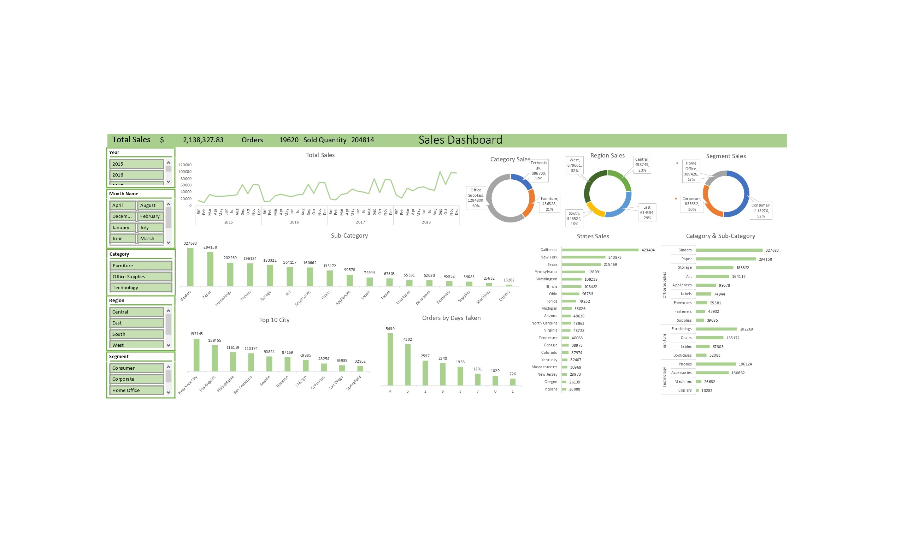
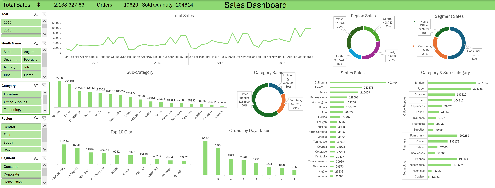

# 📊 Interactive Sales Dashboard (Microsoft Excel)

## Overview
This project is an interactive **Microsoft Excel Sales Dashboard** designed to analyze sales performance from **2015 to 2018**. It provides a clear overview of key business metrics through an intuitive and modern dashboard, enabling users to quickly identify sales trends and make data-driven decisions.

## Features
- Interactive dashboard with dynamic slicers
- KPI tracking and performance monitoring
- Sales trend analysis (2015–2018)
- Modern wireframe-inspired dashboard design
- User-friendly layout for efficient data exploration

## Key Insights
- Monitor overall sales performance using key business KPIs.
- Analyze sales trends over multiple years.
- Filter data dynamically to explore different business perspectives.
- Support informed decision-making through interactive visualizations.

## Tools & Skills
- Microsoft Excel
- PivotTables
- Pivot Charts
- Slicers
- Dashboard Design
- Data Visualization
- KPI Reporting

## Project Preview
### Overview Dashboard

### Details Dashboard

## Files
- `Interactive Sales Dashboard.xlsx` – Excel dashboard
- `README.md` – Project documentation

## Author
**Eyad Muhammad**
- LinkedIn: *(Add your LinkedIn URL)*
- GitHub: *(Add your GitHub URL)*
